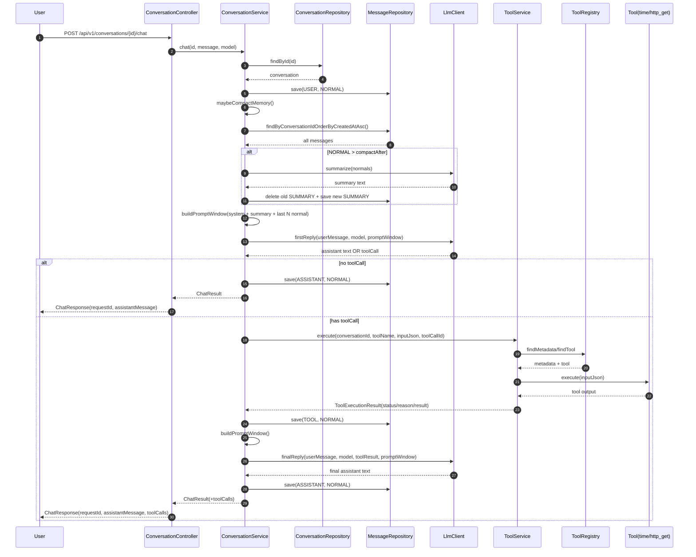
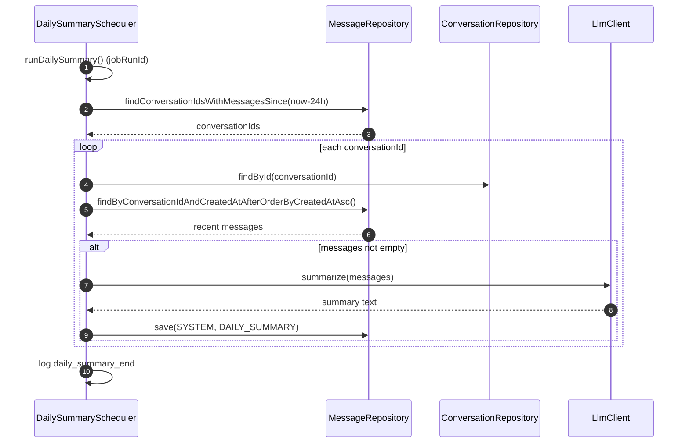

# J. 聊天时序图

## 1) 标准聊天链路（含可选工具调用）

## 2) 工具执行治理点（ToolService）

执行前检查顺序：
1. 工具是否注册（`ToolRegistry`）
2. 是否在 `nsbh.tools.allowed` allowlist 中
3. 所需权限是否在 `nsbh.permissions.granted`
4. 输入大小是否超限（`maxInputBytes`）
5. 执行超时（`timeoutMs`）
6. 输出大小是否超限（`maxOutputBytes`）

审计日志：
- Logger: `TOOL_AUDIT`
- 固定字段：`requestId`, `conversationId`, `toolName`, `status`, `reason`, `durationMs`

## 3) Daily Summary 调度链路

